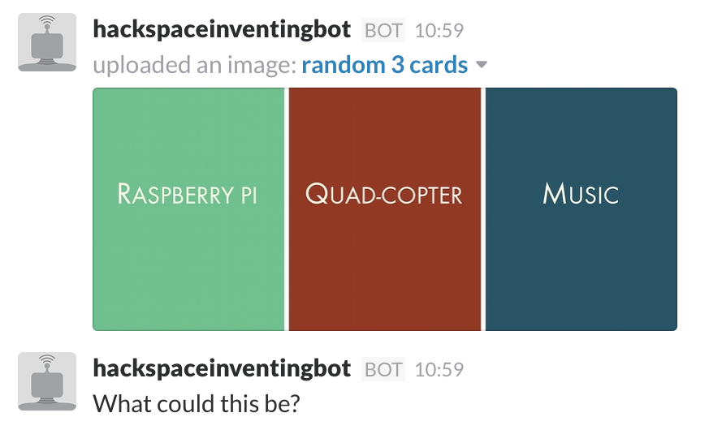

# Hackspace inventing bot

Adds three hackspace inventing cards to the channel.

## Get a bot ID

from https://my.slack.com/services/new/bot

## Run the bot

    SLACK_API_TOKEN="yourkey" node hackspace_slackbot.js

## Troubleshootng

if you get an error

```
throw new Error('Can\'t load the addon. Issue to: ' + bugUrl);
```

(https://github.com/zhangyuanwei/node-images/issues/111)

Use Node 8, e.g.

```
node --version
v10.16.0
brew install nvm
nvm install 8.0.0
nvm use 8.0
```

## Links

slack official node client: https://github.com/slackhq/node-slack-client

## Screenshot



## Thanks

@jarkman wrote the list of cards with advice from @_jhr_ on colour and style.
